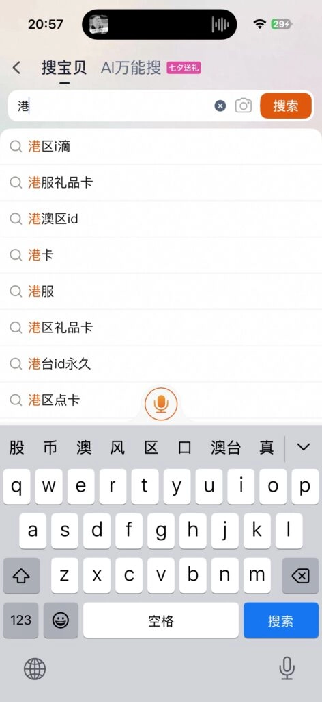
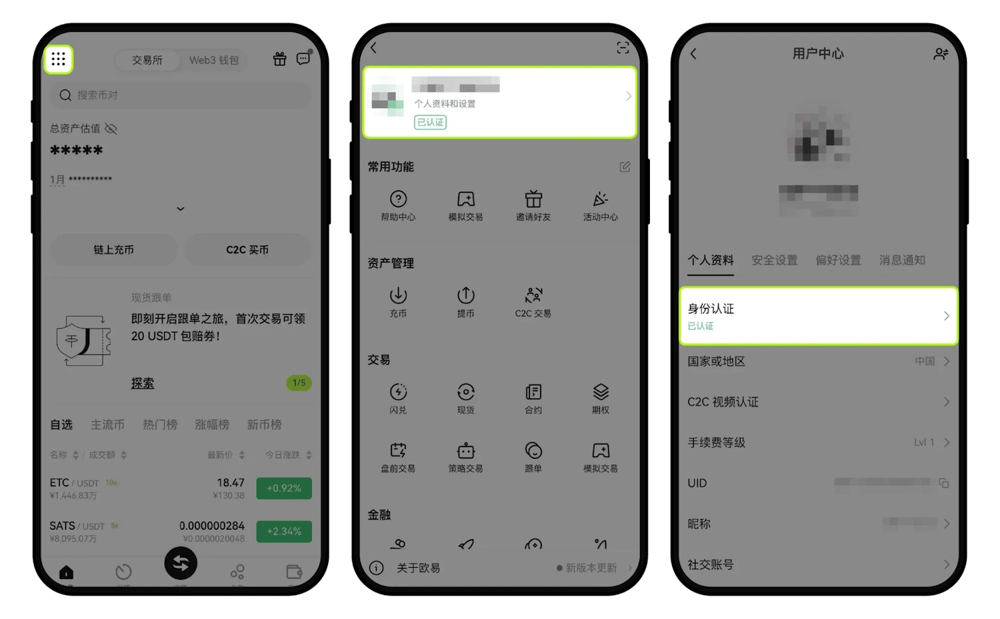
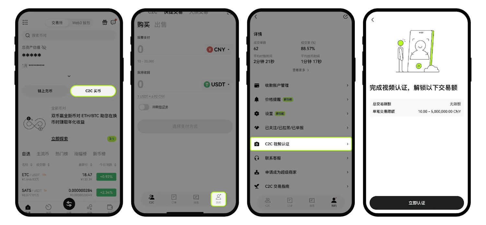

# OKX 注册全流程：从零开始的实操指南

---

你可能听说过OKX，可能被各种教程搞得云里雾里，或者干脆不知道从哪儿下手。没关系，这篇文章就像你找了个懂行的朋友坐下来慢慢聊——怎么注册、怎么过认证、怎么把钱放进去，一步步来，不急。

---

## 开始之前，你得准备这几样东西

不用紧张，都是日常能找到的：

**手机一部**——用来拍身份证，顺便下载 App。

**常用邮箱**——QQ 邮箱、163 都行，别用那种一年没登过的。

**身份证件**——身份证、护照、驾照，三选一。大部分人用身份证就够了。

准备好了？那咱们开始。

---

## 第一步：注册账号（别着急，慢慢来）

打开 👉 [OKX 注册页面](https://www.okx.com/join/62834398)，你会看到一个很简单的界面。

1. **选居住地**——如实选就行，国内用户选中国。
2. **填邮箱**——输入你常用的邮箱。
3. **确认邀请码**——这里填 **62834398**，能省 20% 手续费，别嫌麻烦，能省一点是一点。
4. **输入验证码**——邮箱会收到 6 位数字，填进去。
5. **绑定手机**——输入手机号，再填一次短信验证码。
6. **设密码**——至少 8 位，得有数字、字母、特殊符号。建议别设得太简单，毕竟是钱的事儿。

这一步完成后，账号就算注册好了。但先别高兴太早，还得装个 App 才能用。

---

## 装 App：iOS 和安卓各有各的门道

### 如果你用的是 iPhone

这里有点麻烦。因为合规问题，大陆 App Store 搜不到 OKX。你得切换到非国区账号（比如香港区）才能下载。

**怎么搞？**
- 自己注册一个香港区 Apple ID（网上教程一堆）。
- 或者淘宝买一个现成的（搜"港区账号"）。

切换账号后，直接在 App Store 搜 OKX 就能下了。

### 如果你用的是安卓

简单多了。直接去 [OKX 官网](https://www.okx.com/join/62834398) 下载 APK 文件，安装就行。

**小提示：**如果你用的是小米、华为这些国产手机，安装时可能会被拦截。关掉网络再装试试，成功率高一点。

---

## 第二步：KYC 认证（也就是证明"我是我"）

注册完了还不能交易，得先过个身份认证。这玩意儿叫 KYC（Know Your Customer），说白了就是交易所确认你不是机器人、不是洗钱的。

### 基础认证（必做）

1. 打开 App，点左上角头像→【个人资料和设置】→【身份认证】。
2. 上传身份证正反面照片（拍清楚点，别糊）。
3. 做个人脸识别——跟着提示动动头就行。

完事儿了。这一步过了，你就能充币、提币、买卖币了。

### 视频认证（C2C 交易必做）

如果你想用 C2C 交易（就是直接跟别人买卖 USDT 那种），还得再做一次视频认证。

1. 点【C2C 买币】→【我的】→【C2C 视频认证】。
2. 开摄像头和麦克风，别戴耳机。
3. 系统会读一段风险提示，你不用跟读，听到"嘀"声后说一句"是的"就行。

提交后等审核，通常几分钟到几小时不等。

---

## 第三步：入金（把钱放进去）

认证过了，下一步就是往账户里充钱。OKX 支持 C2C 交易，也就是你直接从其他用户那儿买 USDT（一种稳定币，1 USDT ≈ 1 美元）。

**支付方式挺多：**支付宝、微信、银行卡都行。

操作也简单：点【C2C 买币】→选择金额和支付方式→下单→转账给卖家→确认收款。几分钟就到账了。

---

## 小福利：别忘了领盲盒

注册完认证后，OKX 会给你一个盲盒奖励。首次交易后还能再领一次。平均每人能拿到 7 USDT 左右（大概 50 块钱）。

别嫌少，蚊子腿也是肉。

---

## 写在最后

注册 OKX 其实没那么复杂，无非就是填几个信息、拍几张照片、装个 App。唯一需要点耐心的是 iOS 用户下载 App 那一步，其他都挺顺的。

如果你还在犹豫要不要注册，想想这个：OKX 是全球前三的交易所，手续费低、币种多、提币快。对于刚入圈的人来说，👉 [从 OKX 开始](https://www.okx.com/join/62834398) 是个不错的选择——至少不用担心平台跑路或者卡你的钱。

有啥不清楚的，再回来看这篇。慢慢来,不急。
